# `Capstone`

### CENTRALIZED CATALOG AND BOOK MANAGEMENT SYSTEM

### Project set up

Fill out the Makefile so it compiles the code you place into the 'SRC' directory and outputs a binary named 'Capstone' in a BIN directory. How you structure your SRC directory is up to you. The makefile must run by running 'make' from the directory the Makefile is located in. There is no guarentee a BIN directory will already be present when make is run.

                    .
                    ├── Makefile        # GNU Makefile to build your project(s)
                    ├── SRC             # Source files
                    │   ├── file.c
                    │   └── file.h
                    ├── BIN             # Compiled files
                    │   └── Capstone    # The Compile program
                    ├── Tests
                    └── README.md       # User Guide

---

### PURPOSE

The intent of this capstone is for you to display your ability to build a program that completes a specified task. It is expected that you use or modify code generated from any previous sections of the exam to complete this task.

### GENERAL OVERVIEW

You have been tasked with writing a new centralized catalog for a local library that has limited number of Books to share amongst multiple locations. Key considerations in the developmentothe system are as follows:

- Reliability (Does not crash)
- Input validation
- Persistence (Maintain catalog state after crash or reboot)
- Supports multiple clients (minimum 20)

### FOCUS AREAS

- Network programming in C
- Network programming in Python3
- Multithreading in C
- Input validation in Python3
- File I/O in C
- File I/O in Python3

---

### `REQUIREMENTS`

#### GENERAL REQUIREMENTS

- Composed of a CATALOG management server (C) and client (Python3) application.
- Input validation and error checking must be performed where appropriate
- Well documented code
- Clear concise variable names
- A user guide requirements (At a minimum):
  - How to start the service
  - How to connect
  - How to interact with client
  - Known issues

#### SERVER REQUIREMENTS

- Must be written in C.
- Maintains a list of authorized users.
- Supports registering new users.
- Ensure that the same book is only checked out one at a time.
- Supports the ability to add new books to the CATALOG.
- Supports the ability to delete books from the CATALOG.
- Forward the inventory of all items to the client that requested it.
- Make use of a worker pool threading model with a minimum of 10 workers.
- Support listening for multiple connections at a time.
- Support receiving receiving commands from multiple clients at the same time.
- Automatically recollect books when checkout request duration ends. Request duration is specified in DDMMMYYYY.
- Supports viewing book avalaibility in format specified below:
  BOOK NAME TOTAL ON HAND AVAILABLE
- Support the ability to print an inventory report of all items to a file in the format below for a given date:
  BOOK NAME TOTAL ON HAND IN USE AVAILABLE
- Maintain persistent state of all users and books in the event of a crash and/or system restart.

#### CLIENT REQUIREMENTS

- Must be written in Python3
- Connect to the server at a specified PORT and IP address (Both should be command line arguments)
- Additional commands must prompt user for input.
- Support the following operations:
  - Connect to server - Connects to a server at a given IPV4 Address and PORT
  - Add User - Creates a new user of logged into an authenticated user. Requires a name and password to be given.
  - Get inventory report - Gets a list of all items in the distribution center.
  - Request Book - Retrieves the Book from the server if it is still avaliable.
  - Add Book - Adds a new Book to the server.
  - Return Book - Returns a existing Book the server.
  - Delete Book - Deletes a number of books with the same title from the catalog

---

### PROTOCOL AND SEQUENCE DIAGRAMS

<table>
<thead>
<td align="center" colspan=2>COMMAND VALUES</td>
</thead>
<thead>
<td> CMD</td>
<td> VALUE</td>
</thead>
<tr><td> SUCCESS</td><td> 0x0 </td></tr>
<tr><td> CONNECT</td><td> 0x1 </td></tr>
<tr><td> ADD USER</td><td> 0x2 </td></tr>
<tr><td> REQUEST BOOK</td><td> 0x3 </td></tr>
<tr><td> ADD BOOK</td><td> 0x4 </td></tr>
<tr><td> REQUEST INVENTORY REPORT</td><td> 0x5 </td></tr>
<tr><td> RETURN BOOK</td><td> 0x6 </td></tr>
<tr><td> DELETE BOOK</td><td> 0x7 </td></tr>
<tr><td> ACK </td><td> 0xe </td></tr>
<tr><td> ERROR </td><td> 0xf </td></tr>
<tbody>
</tbody>
</table>

---

#### Success, Ack, Error Messages

The Success, Acknowledge (Ack), and Error message types have no payload. They are simply a single byte with the first nibble representing the command value and the second nibble unused.

<table class="tg">
  <tr>
    <th class="tg-wp8o"></th>
    <th class="tg-wp8o" colspan="8">0</th>
  </tr>
  <tr>
    <td class="tg-c3ow">BITS</td>
    <td class="tg-ezbu">0</td>
    <td class="tg-c3ow">1</td>
    <td class="tg-ezbu">2</td>
    <td class="tg-c3ow">3</td>
    <td class="tg-ezbu">4</td>
    <td class="tg-c3ow">5</td>
    <td class="tg-ezbu">6</td>
    <td class="tg-c3ow">7</td>
  </tr>
  <tr>
    <td class="tg-c3ow">0 BYTES</td>
    <td class="tg-ezbu" colspan="4">CMD</td>
    <td class="tg-ezbu" colspan="4">RESERVED</td>
  </tr>
</table>

---

#### CONNECT Message

The connect function requires one message to be sent to the server. The connect message stores length of the username followed by an ascii string of that legth containing the username in plaintext followed by the password in plaintext. The password field should be XOR encrypted with a shared "key" between the server and the client. 

<table class="tg">
  <tr>
    <th class="tg-wp8o"></th>
    <th class="tg-wp8o" colspan="8">0</th>
    <th class="tg-wp8o" colspan="8">1</th>
    <th class="tg-wp8o" colspan="8">2</th>
    <th class="tg-ao2g" colspan="8">3</th>
  </tr>
  <tr>
    <td class="tg-c3ow">BITS</td>
    <td class="tg-ezbu">0</td>
    <td class="tg-c3ow">1</td>
    <td class="tg-ezbu">2</td>
    <td class="tg-c3ow">3</td>
    <td class="tg-ezbu">4</td>
    <td class="tg-c3ow">5</td>
    <td class="tg-ezbu">6</td>
    <td class="tg-c3ow">7</td>
    <td class="tg-ezbu">8</td>
    <td class="tg-c3ow">9</td>
    <td class="tg-ezbu">10</td>
    <td class="tg-c3ow">11</td>
    <td class="tg-ezbu">12</td>
    <td class="tg-c3ow">13</td>
    <td class="tg-ezbu">14</td>
    <td class="tg-c3ow">15</td>
    <td class="tg-ezbu">16</td>
    <td class="tg-c3ow">17</td>
    <td class="tg-ezbu">18</td>
    <td class="tg-c3ow">19</td>
    <td class="tg-ezbu">20</td>
    <td class="tg-c3ow">21</td>
    <td class="tg-ezbu">22</td>
    <td class="tg-c3ow">23</td>
    <td class="tg-ezbu">24</td>
    <td class="tg-c3ow">25</td>
    <td class="tg-ezbu">26</td>
    <td class="tg-c3ow">27</td>
    <td class="tg-ezbu">28</td>
    <td class="tg-c3ow">29</td>
    <td class="tg-ezbu">30</td>
    <td class="tg-c3ow">31</td>
  </tr>
  <tr>
    <td class="tg-c3ow">0 BYTES</td>
    <td class="tg-ezbu" colspan="4">CMD</td>
    <td class="tg-ezbu" colspan="4">RESERVED</td>
    <td class="tg-ezbu" colspan="8">Password Len</td>
    <td class="tg-ezbu" colspan="16">Username Len</td>
  </tr>
  <tr>
    <td class="tg-c3ow">4 BYTES</td>
    <td class="tg-ezbu" colspan="32" rowspan="3">USERNAME</td>
  </tr>
  <tr>
    <td class="tg-c3ow">...</td>
  <tr>
    <td class="tg-c3ow">4 + Username Len BYTES</td>
  </tr>
  <tr>
  <tr>
    <td class="tg-c3ow">4 + Username Len + 1 BYTES</td>
    <td class="tg-ezbu" colspan="32" rowspan="2">PASSWORD</td>
  </tr>
  <tr>
    <td class="tg-c3ow">4 + Username Len + 1  + Pass Len BYTES</td>
  </tr>
</table>

All connections to the server must begin with the following sequence of events. On authentication failure the sever will disconnect with the client.

##### CONNECT SEQUENCE DIAGRAM

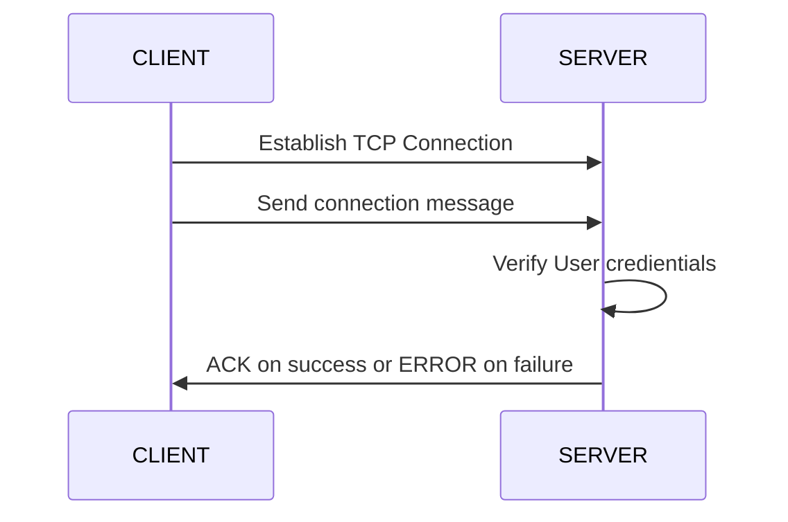

The flow chart for a server verifying user credientials looks as so:

##### Auth flowchart
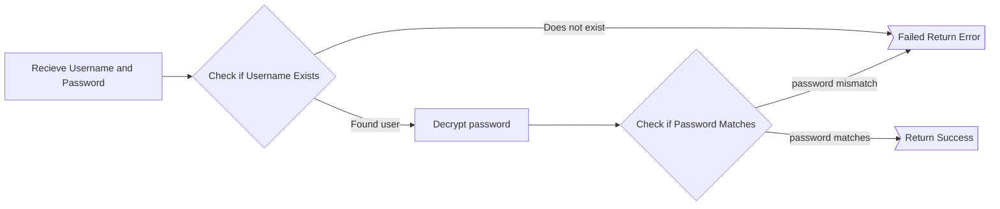

---

#### ADD USER Function

The add user function consists of a series of messages passed between the server and client. Fist the client must sign in with a known user. Then the client will start by sending an ADD USER message containing the username of the user to add. The server will then either send an ACK message or ERROR message if the username is available or not. If the username is available, the client will then send another ADD USER message containing the password. If the server is succesful in creating a new password the server returns a SUCCESS message. At any point during the transaction the server can send an ERROR message to the client reporting some sort of failure. If an ERROR message is sent to the client the internal state of the server should be such that the ADD USER messages were never sent. The entire transaction should take no longer that 10 seconds and the server should timeout with an ERROR message if the client is taking too long. Usernames should be no longer than 65535 bytes and passwords should be no longer than 255 bytes. Passwords should have the same XOR encryption as in the CONNECT message.

<table class="tg">
  <tr>
    <th class="tg-wp8o"></th>
    <th class="tg-wp8o" colspan="8">0</th>
    <th class="tg-wp8o" colspan="8">1</th>
    <th class="tg-wp8o" colspan="8">2</th>
    <th class="tg-ao2g" colspan="8">3</th>
  </tr>
  <tr>
    <td class="tg-c3ow">BITS</td>
    <td class="tg-ezbu">0</td>
    <td class="tg-c3ow">1</td>
    <td class="tg-ezbu">2</td>
    <td class="tg-c3ow">3</td>
    <td class="tg-ezbu">4</td>
    <td class="tg-c3ow">5</td>
    <td class="tg-ezbu">6</td>
    <td class="tg-c3ow">7</td>
    <td class="tg-ezbu">8</td>
    <td class="tg-c3ow">9</td>
    <td class="tg-ezbu">10</td>
    <td class="tg-c3ow">11</td>
    <td class="tg-ezbu">12</td>
    <td class="tg-c3ow">13</td>
    <td class="tg-ezbu">14</td>
    <td class="tg-c3ow">15</td>
    <td class="tg-ezbu">16</td>
    <td class="tg-c3ow">17</td>
    <td class="tg-ezbu">18</td>
    <td class="tg-c3ow">19</td>
    <td class="tg-ezbu">20</td>
    <td class="tg-c3ow">21</td>
    <td class="tg-ezbu">22</td>
    <td class="tg-c3ow">23</td>
    <td class="tg-ezbu">24</td>
    <td class="tg-c3ow">25</td>
    <td class="tg-ezbu">26</td>
    <td class="tg-c3ow">27</td>
    <td class="tg-ezbu">28</td>
    <td class="tg-c3ow">29</td>
    <td class="tg-ezbu">30</td>
    <td class="tg-c3ow">31</td>
  </tr>
  <tr>
    <td class="tg-c3ow">0 BYTES</td>
    <td class="tg-ezbu" colspan="4">CMD</td>
    <td class="tg-ezbu" colspan="12">RESERVED</td>
    <td class="tg-ezbu" colspan="16">DATA Len</td>
  </tr>
  <tr>
    <td class="tg-c3ow">4 BYTES</td>
    <td class="tg-ezbu" colspan="32" rowspan="3">DATA </td>
  </tr>
  <tr>
    <td class="tg-c3ow">...</td>
  </tr>
  <tr>
    <td class="tg-c3ow">4 + Data Len</td>
  </tr>
</table>

The sequence diagram for the add user function is visually explained below. This diagram assumes the tranaction is successful.

##### ADD USER SEQUENCE DIAGRAM

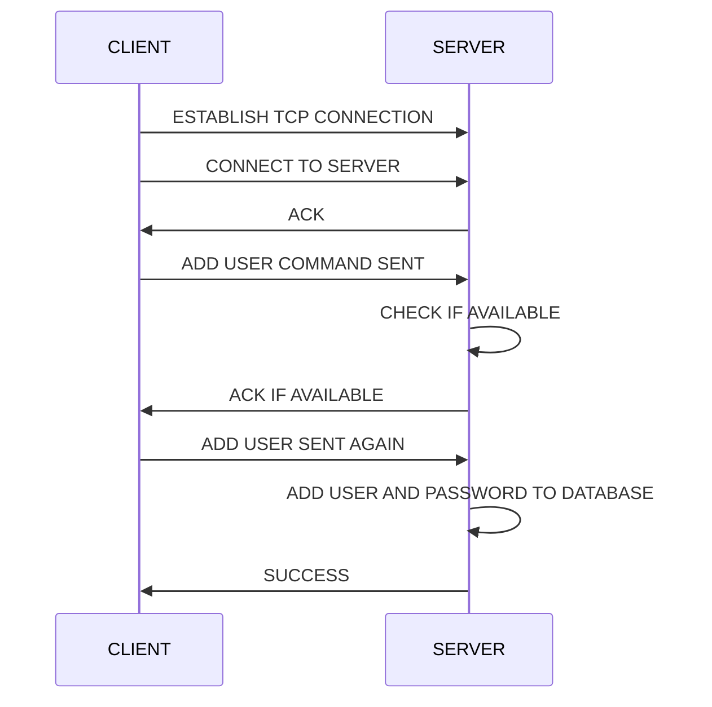

The flow diagram for the server side transaction should be as follows:

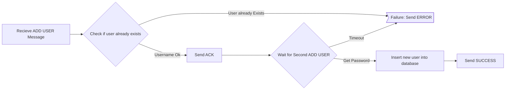

---

#### REQUEST BOOK

The request book message requests a single book from the server for checkout. As always the client must be authenticated with the server with the connect message. Once authenticated the client will send a REQUEST BOOK message to the server containing the title of the book and the expected return time, in seconds. The expected return time is the unix epoch time (a signed 32bit integer) that specifies the second the book is due. The request book message is as follows. Each use can only checkout a single copy of each book title. 

<table class="tg">
  <tr>
    <th class="tg-wp8o"></th>
    <th class="tg-wp8o" colspan="8">0</th>
    <th class="tg-wp8o" colspan="8">1</th>
    <th class="tg-wp8o" colspan="8">2</th>
    <th class="tg-ao2g" colspan="8">3</th>
  </tr>
  <tr>
    <td class="tg-c3ow">BITS</td>
    <td class="tg-ezbu">0</td>
    <td class="tg-c3ow">1</td>
    <td class="tg-ezbu">2</td>
    <td class="tg-c3ow">3</td>
    <td class="tg-ezbu">4</td>
    <td class="tg-c3ow">5</td>
    <td class="tg-ezbu">6</td>
    <td class="tg-c3ow">7</td>
    <td class="tg-ezbu">8</td>
    <td class="tg-c3ow">9</td>
    <td class="tg-ezbu">10</td>
    <td class="tg-c3ow">11</td>
    <td class="tg-ezbu">12</td>
    <td class="tg-c3ow">13</td>
    <td class="tg-ezbu">14</td>
    <td class="tg-c3ow">15</td>
    <td class="tg-ezbu">16</td>
    <td class="tg-c3ow">17</td>
    <td class="tg-ezbu">18</td>
    <td class="tg-c3ow">19</td>
    <td class="tg-ezbu">20</td>
    <td class="tg-c3ow">21</td>
    <td class="tg-ezbu">22</td>
    <td class="tg-c3ow">23</td>
    <td class="tg-ezbu">24</td>
    <td class="tg-c3ow">25</td>
    <td class="tg-ezbu">26</td>
    <td class="tg-c3ow">27</td>
    <td class="tg-ezbu">28</td>
    <td class="tg-c3ow">29</td>
    <td class="tg-ezbu">30</td>
    <td class="tg-c3ow">31</td>
  </tr>
  <tr>
    <td class="tg-c3ow">0 BYTES</td>
    <td class="tg-ezbu" colspan="4">CMD</td>
    <td class="tg-ezbu" colspan="12">RESERVED</td>
    <td class="tg-ezbu" colspan="16">Book Name Len</td>
  </tr>
  <tr>
    <td class="tg-c2ow">4 BYTES</td>
    <td class="tg-ezbu" colspan="32" rowspan="2">Return Time</td>
  </tr>
  <tr>
    <td class="tg-c2ow">8 BYTES</td>
  </tr>
  <tr>
    <td class="tg-c3ow">12 BYTES</td>
    <td class="tg-ezbu" colspan="32" rowspan="3">BOOK NAME</td>
  </tr>
  <tr>
    <td class="tg-c3ow">...</td>
  </tr>
  <tr>
    <td class="tg-c3ow">4 + Book name len</td>
  </tr>
</table>

The squence diagram for requesting a book is as follows.

##### REQUEST SEQUENCE DIAGRAM

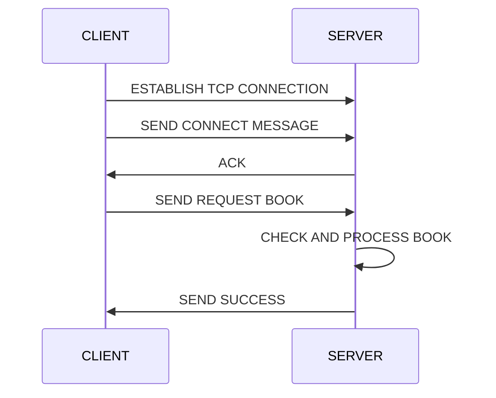
The server-side flow diagram for requesting a book should look as the following:

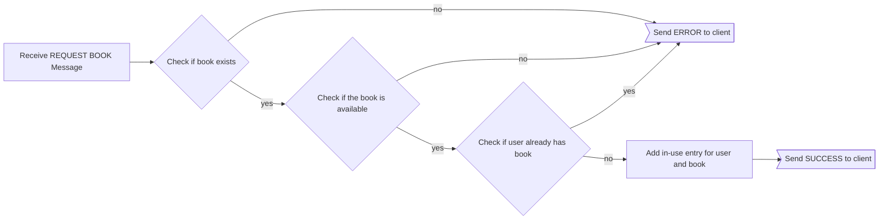
---

#### ADD BOOK

The add book message takes the book name and quantity of books and sends them to the server to be added to the catalog. As in all libraries, our library server can have multiple of the same book. This message will allow a client to add mulitple of the same book to the library.

<table class="tg">
  <tr>
    <th class="tg-wp8o"></th>
    <th class="tg-wp8o" colspan="8">0</th>
    <th class="tg-wp8o" colspan="8">1</th>
    <th class="tg-wp8o" colspan="8">2</th>
    <th class="tg-ao2g" colspan="8">3</th>
  </tr>
  <tr>
    <td class="tg-c3ow">BITS</td>
    <td class="tg-ezbu">0</td>
    <td class="tg-c3ow">1</td>
    <td class="tg-ezbu">2</td>
    <td class="tg-c3ow">3</td>
    <td class="tg-ezbu">4</td>
    <td class="tg-c3ow">5</td>
    <td class="tg-ezbu">6</td>
    <td class="tg-c3ow">7</td>
    <td class="tg-ezbu">8</td>
    <td class="tg-c3ow">9</td>
    <td class="tg-ezbu">10</td>
    <td class="tg-c3ow">11</td>
    <td class="tg-ezbu">12</td>
    <td class="tg-c3ow">13</td>
    <td class="tg-ezbu">14</td>
    <td class="tg-c3ow">15</td>
    <td class="tg-ezbu">16</td>
    <td class="tg-c3ow">17</td>
    <td class="tg-ezbu">18</td>
    <td class="tg-c3ow">19</td>
    <td class="tg-ezbu">20</td>
    <td class="tg-c3ow">21</td>
    <td class="tg-ezbu">22</td>
    <td class="tg-c3ow">23</td>
    <td class="tg-ezbu">24</td>
    <td class="tg-c3ow">25</td>
    <td class="tg-ezbu">26</td>
    <td class="tg-c3ow">27</td>
    <td class="tg-ezbu">28</td>
    <td class="tg-c3ow">29</td>
    <td class="tg-ezbu">30</td>
    <td class="tg-c3ow">31</td>
  </tr>
  <tr>
    <td class="tg-c3ow">0 BYTES</td>
    <td class="tg-ezbu" colspan="4">CMD</td>
    <td class="tg-ezbu" colspan="12">RESERVED</td>
    <td class="tg-ezbu" colspan="16">NUMBER OF BOOKS TO ADD</td>
  </tr>
  <tr>
    <td class="tg-c30w">4 BYTES</td>
    <td class="tg-ezbu" colspan=16>BOOK NAME LEN</td>
    <td class="tg-ezbu" colspan=16>BOOK NAME</td>
  </tr>
  <tr>
    <td class="tg-c3ow">28 BYTES</td>
    <td class="tg-ezbu" colspan="32" rowspan="3">BOOK NAME </td>
  </tr>
  <tr>
    <td class="tg-c3ow">32 BYTES</td>
  </tr>
  <tr>
    <td class="tg-c3ow">36 BYTES</td>
  </tr>
</table>

The sequence diagram for client-server interaction is as follows:
##### ADD BOOK SEQUENCE DIAGRAM

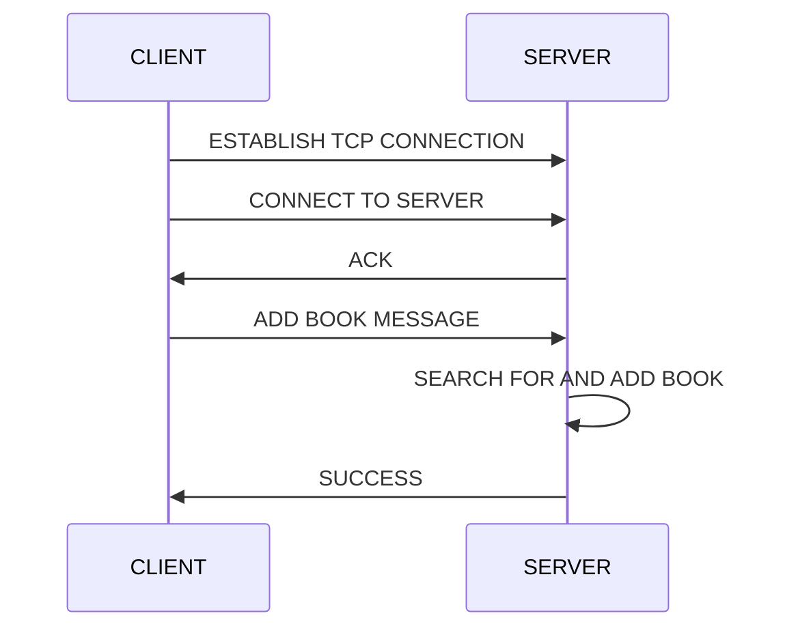

The server-side flow for adding a book should look as the following:

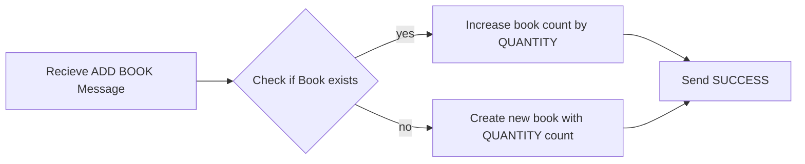
---

#### RETURN BOOK

The return book message takes the book name and returns it for that user. Remeber, a user can only checkout one copy of a book at a time and that user must be the one to return the book.
<table class="tg">
  <tr>
    <th class="tg-wp8o"></th>
    <th class="tg-wp8o" colspan="8">0</th>
    <th class="tg-wp8o" colspan="8">1</th>
    <th class="tg-wp8o" colspan="8">2</th>
    <th class="tg-ao2g" colspan="8">3</th>
  </tr>
  <tr>
    <td class="tg-c3ow">BITS</td>
    <td class="tg-ezbu">0</td>
    <td class="tg-c3ow">1</td>
    <td class="tg-ezbu">2</td>
    <td class="tg-c3ow">3</td>
    <td class="tg-ezbu">4</td>
    <td class="tg-c3ow">5</td>
    <td class="tg-ezbu">6</td>
    <td class="tg-c3ow">7</td>
    <td class="tg-ezbu">8</td>
    <td class="tg-c3ow">9</td>
    <td class="tg-ezbu">10</td>
    <td class="tg-c3ow">11</td>
    <td class="tg-ezbu">12</td>
    <td class="tg-c3ow">13</td>
    <td class="tg-ezbu">14</td>
    <td class="tg-c3ow">15</td>
    <td class="tg-ezbu">16</td>
    <td class="tg-c3ow">17</td>
    <td class="tg-ezbu">18</td>
    <td class="tg-c3ow">19</td>
    <td class="tg-ezbu">20</td>
    <td class="tg-c3ow">21</td>
    <td class="tg-ezbu">22</td>
    <td class="tg-c3ow">23</td>
    <td class="tg-ezbu">24</td>
    <td class="tg-c3ow">25</td>
    <td class="tg-ezbu">26</td>
    <td class="tg-c3ow">27</td>
    <td class="tg-ezbu">28</td>
    <td class="tg-c3ow">29</td>
    <td class="tg-ezbu">30</td>
    <td class="tg-c3ow">31</td>
  </tr>
  <tr>
    <td class="tg-c3ow">0 BYTES</td>
    <td class="tg-ezbu" colspan="4">CMD</td>
    <td class="tg-ezbu" colspan="4">RESERVED</td>
    <td class="tg-ezbu" colspan="16">BOOK NAME LEN</td>
    <td class="tg-ezbu" colspan="8">BOOK NAME</td>
  </tr>
  <tr>
    <td class="tg-c3ow">4 BYTES</td>
    <td class="tg-ezbu" colspan="32" rowspan="3">BOOK NAME </td>
  </tr>
  <tr>
    <td class="tg-c3ow">8 BYTES</td>
  </tr>
  <tr>
    <td class="tg-c3ow">12 BYTES</td>
  </tr>
</table>

The client-server interaction squence diagram of a succesfull transaction is as follows:

##### RETURN BOOK SEQUENCE DIAGRAM

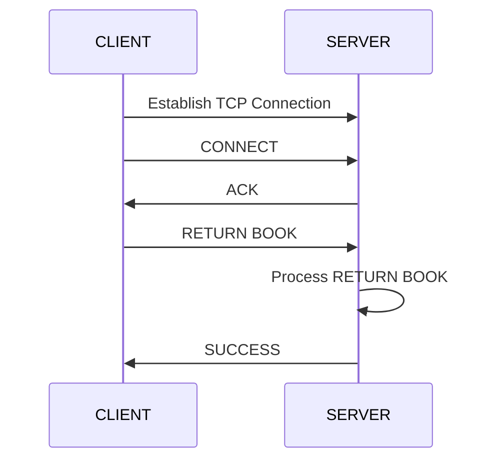

The server-side process flow for the RETURN BOOK message is as follows:

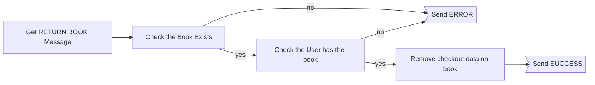

#### DELETE BOOK

The delete book message takes the book name and quantity of that book and sends them to the server to be removed from the catalog. Reference the diagram below for the message layout. Note that only books of the same title may be removed at a time and that you can not remove more books than you have in your catalog (Not including whats checked out).

<table class="tg">
  <tr>
    <th class="tg-wp8o"></th>
    <th class="tg-wp8o" colspan="8">0</th>
    <th class="tg-wp8o" colspan="8">1</th>
    <th class="tg-wp8o" colspan="8">2</th>
    <th class="tg-ao2g" colspan="8">3</th>
  </tr>
  <tr>
    <td class="tg-c3ow">BITS</td>
    <td class="tg-ezbu">0</td>
    <td class="tg-c3ow">1</td>
    <td class="tg-ezbu">2</td>
    <td class="tg-c3ow">3</td>
    <td class="tg-ezbu">4</td>
    <td class="tg-c3ow">5</td>
    <td class="tg-ezbu">6</td>
    <td class="tg-c3ow">7</td>
    <td class="tg-ezbu">8</td>
    <td class="tg-c3ow">9</td>
    <td class="tg-ezbu">10</td>
    <td class="tg-c3ow">11</td>
    <td class="tg-ezbu">12</td>
    <td class="tg-c3ow">13</td>
    <td class="tg-ezbu">14</td>
    <td class="tg-c3ow">15</td>
    <td class="tg-ezbu">16</td>
    <td class="tg-c3ow">17</td>
    <td class="tg-ezbu">18</td>
    <td class="tg-c3ow">19</td>
    <td class="tg-ezbu">20</td>
    <td class="tg-c3ow">21</td>
    <td class="tg-ezbu">22</td>
    <td class="tg-c3ow">23</td>
    <td class="tg-ezbu">24</td>
    <td class="tg-c3ow">25</td>
    <td class="tg-ezbu">26</td>
    <td class="tg-c3ow">27</td>
    <td class="tg-ezbu">28</td>
    <td class="tg-c3ow">29</td>
    <td class="tg-ezbu">30</td>
    <td class="tg-c3ow">31</td>
  </tr>
  <tr>
    <td class="tg-c3ow">0 BYTES</td>
    <td class="tg-ezbu" colspan="4">CMD</td>
    <td class="tg-ezbu" colspan="12">RESERVED</td>
    <td class="tg-ezbu" colspan="16">NUMBER OF BOOKS TO DELTE</td>
  </tr>
  <tr>
    <td class="tg-c3ow">4 BYTES</td>
    <td class="tg-ezbu" colspan="16">Book Name Len</td>
    <td class="tg-ezbu" colspan="16">Book Name</td>
  </tr>
  <tr>
    <td class="tg-c3ow">8 BYTES</td>
    <td class="tg-ezbu" colspan="32" rowspan="3">BOOK NAME (Cont)</td>
  </tr>
  <tr>
    <td class="tg-c3ow">12 BYTES</td>
  </tr>
  <tr>
    <td class="tg-c3ow">16 BYTES</td>
  </tr>
</table>

The client-server interaction sequence diagram for a successful transaction of the DELETE BOOK transaction is as follows:

##### DELETE BOOK SEQUENCE DIAGRAM

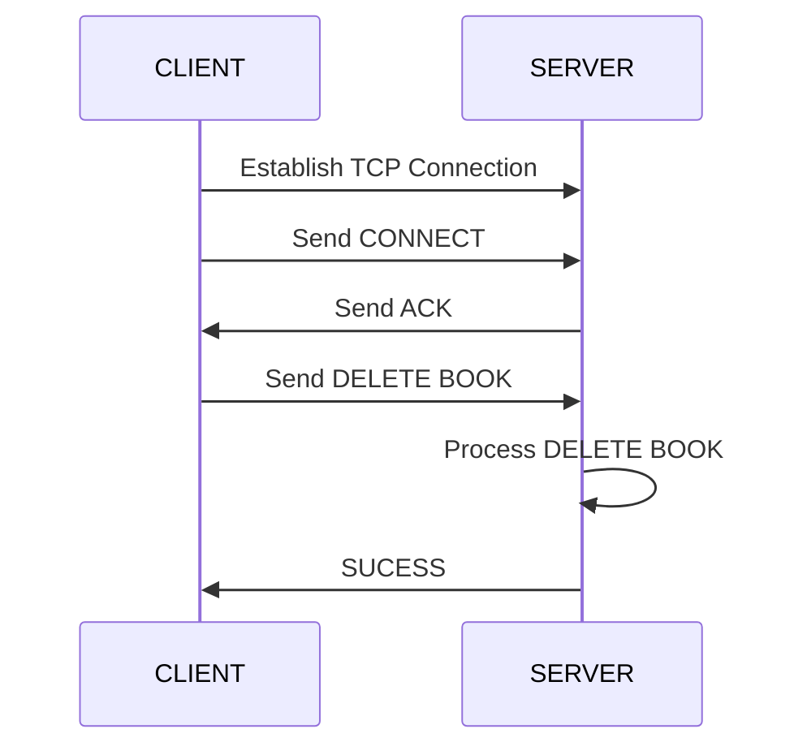

The server-side flow chart for the DELETE BOOK transaction.

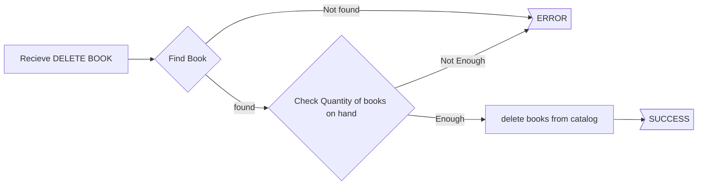

#### REQUEST REPORT

The REQUEST REPORT message allows the client to request an inventory of the catalog. This inventory will include the book name, the number of books on hand and the number of book that are currently checked out. The design of the response from the server is up to the test taker. When the client receives the response, it should be displayed to the screen as well as written to a file. When the client sends the request, the server will acknowledge the request and close the connection. In the request the client will put a port number the server can contact the client on. When the report is ready to be sent the server will send the report to the client on the port the client specified. Books that are overdue should be noted as such.

<table class="tg">
  <tr>
    <th class="tg-wp8o"></th>
    <th class="tg-wp8o" colspan="8">0</th>
    <th class="tg-wp8o" colspan="8">1</th>
    <th class="tg-wp8o" colspan="8">2</th>
    <th class="tg-ao2g" colspan="8">3</th>
  </tr>
  <tr>
    <td class="tg-c3ow">BITS</td>
    <td class="tg-ezbu">0</td>
    <td class="tg-c3ow">1</td>
    <td class="tg-ezbu">2</td>
    <td class="tg-c3ow">3</td>
    <td class="tg-ezbu">4</td>
    <td class="tg-c3ow">5</td>
    <td class="tg-ezbu">6</td>
    <td class="tg-c3ow">7</td>
    <td class="tg-ezbu">8</td>
    <td class="tg-c3ow">9</td>
    <td class="tg-ezbu">10</td>
    <td class="tg-c3ow">11</td>
    <td class="tg-ezbu">12</td>
    <td class="tg-c3ow">13</td>
    <td class="tg-ezbu">14</td>
    <td class="tg-c3ow">15</td>
    <td class="tg-ezbu">16</td>
    <td class="tg-c3ow">17</td>
    <td class="tg-ezbu">18</td>
    <td class="tg-c3ow">19</td>
    <td class="tg-ezbu">20</td>
    <td class="tg-c3ow">21</td>
    <td class="tg-ezbu">22</td>
    <td class="tg-c3ow">23</td>
    <td class="tg-ezbu">24</td>
    <td class="tg-c3ow">25</td>
    <td class="tg-ezbu">26</td>
    <td class="tg-c3ow">27</td>
    <td class="tg-ezbu">28</td>
    <td class="tg-c3ow">29</td>
    <td class="tg-ezbu">30</td>
    <td class="tg-c3ow">31</td>
  </tr>
  <tr>
    <td class="tg-c3ow">0 BYTES</td>
    <td class="tg-ezbu" colspan="4">CMD</td>
    <td class="tg-ezbu" colspan="4">RESERVED</td>
    <td class="tg-ezbu" colspan="16">LISTENING REPORT</td>
    <td class="tg-ezbu" colspan="8">RESERVED</td>
  </tr>
</table>

The client-server interaction seqence diagram is as follows:

##### REQUEST REPORT SEQUENCE DIAGRAM

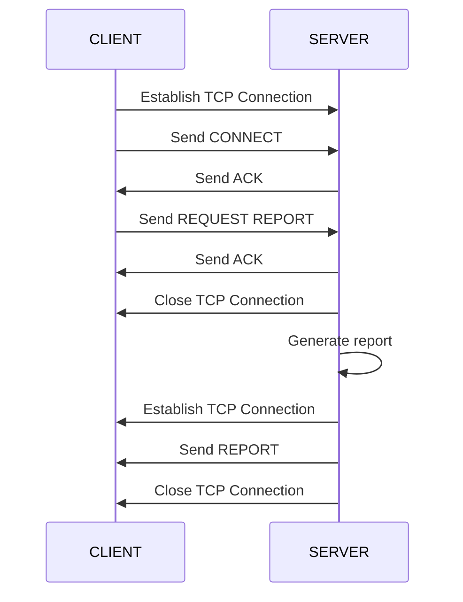

The control flow logic for generating a report should resemble the following:

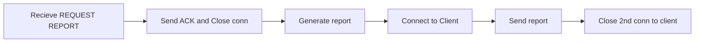
---

### Final Notes
This section will contian some final notes on the design of the catalog server.

1. When a book that is checked out expires, it remains unavaliable until the book is returned. 
2. A user can only check out a single copy of the same book. 
3. A user can checkout mulitple different books.
4. All connections use TCP
5. All connections must first be authenticated with the connect message. (With exception to the server->client connection in REQUEST REPORT)
---

### EVALUATION CRITERIA

General:

- Delivered completion of specified requirements.

Documentation:

- Well documented code
- A user guide requirements (At a minimum):
  - How to start the service
  - How to connect
  - How to interact with client
  - Known issues

Programming:

- Data validation and error checking must be performed where appropriate interfaces exist.
- Clear concise naming conventions used.

Server Requirements:

- Must authenticate users.
- Must support multiple clients.
- Must support thread pool as specified. Free of race conditions and/or deadlocks.
- Must manage book catalog as specified by requirements.
- Must support inventory report generation as specified.
- Maintain persistent state of all users and books in the event of a crash and/or system restart.
- Must properly manage all memory allocations. No lost memory blocks.

Client Requirements:

- Must support commands specified in client requirements.

---

#### C Coding Standard

| Language | Style Guide                                                             |
| :------: | :---------------------------------------------------------------------- |
|    C     | https://barrgroup.com/Embedded-Systems/Books/Embedded-C-Coding-Standard |

#### Python Coding Standard

| Language  | Style Guide                                     |
| :-------: | :---------------------------------------------- |
| Python 3+ | http://google.github.io/styleguide/pyguide.html |

---

#### Build OS to be tested against

Ubuntu 18.04.3 LTS

#### Compilation

All Compilation is to utilize gcc and the GNU make utility. Each section will have their own Makefile respectively.
